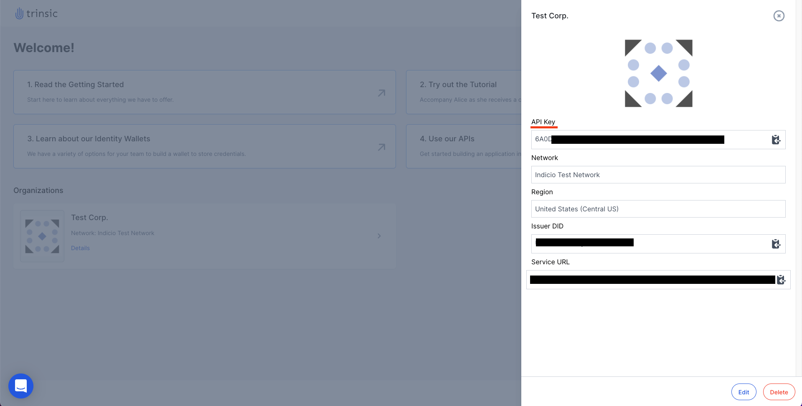

# Trinsic Wallet Reference App

This demo shows how to use Trinsic's Wallet API to manage cloud-based wallets under your Trinsic account. It is a Node.js backend which makes calls to the Trinsic Wallet API using the javascript service client.

## Use Case
In this very simple use case you control custodial wallets for an organization. Each wallet has the ability to make connections, accept credentials, and prove verification requests.

## Prerequisites:
- [npm](https://www.npmjs.com/get-npm) - Make sure you have the latest **stable** version.

## Setup

### - Use a Cloud Dev Environment
Click the `Run on Replit` badge at the top of this readme. You'll need to sign up for a free https//replit.com account to use this option, but it saves configuration time.
### - Download project and install dependencies locally
1. Clone the repository
- `git clone https://github.com/trinsic-id/wallet-reference-app.git`
2. Navigate to the project directory
- `cd wallet-reference-app`
3. Install dependencies
- `npm install`
4. Open the project in the code editor of your choice
5. Rename the `.env-template` file to `.env`

## Configure your organization
1. Go to <a href="https://studio.trinsic.id" target="_blank">Trinsic Studio</a> and login or create an account.
2. Click the **+ Organization** button to slide out the **Add Organization** slider.
3. Enter an organization name and make sure to select the Indicio Test Network.
4. Click on **Confirm** to create the organization.
  - It might take a few seconds to create the organization. Just wait for it to finish.
5. Click on the **Details** button associated with the new organization to open the organization details tab.

6. Follow one of the options below 
  - For local environments: In the `.env` file, add your organization's API Key to the `ACCESS_TOKEN` field;
  - For replit: Go to the Secrets page in the side bar (the lock icon), and add ACCESS_TOKEN field as a Secret.

## Running the application
After creating the new organization you are ready to get started
1. Run the server with `npm start`
2. Navigate to <a href="http://localhost:8000" target="_blank">localhost:8000</a> to see the web app
3. On the web app create a wallet by filling in the information on the left

4. View wallet details by clicking on the blue arrow next to a wallet
5. Here you can see pending actions, view existing credentials, and accept connection requests

## Wallet API Documentation
For more information on the wallet API visit the documentation at [docs.trinsic.id](https://docs.trinsic.id/reference).

> Contact <support@trinsic.com> for any questions.
