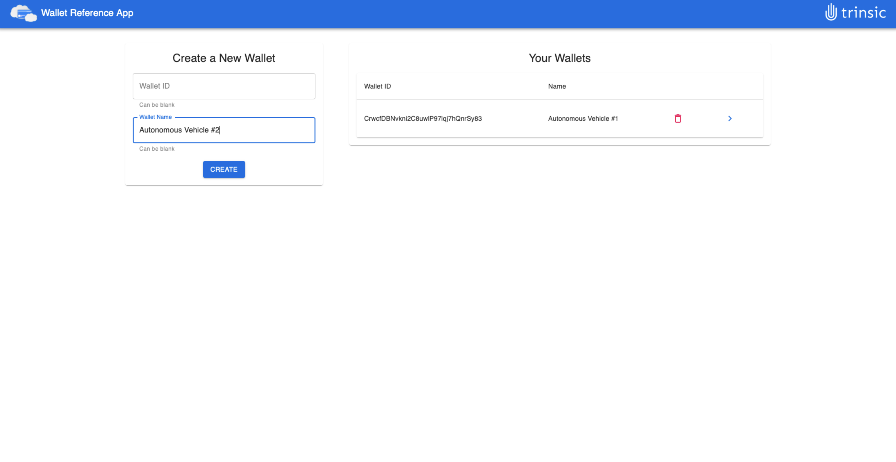
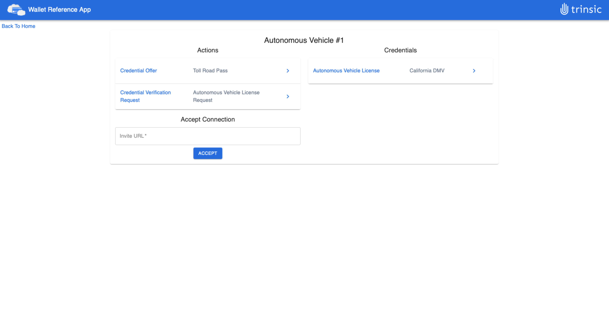

# Trinsic Wallet Reference App
This demo shows how to use Trinsic's Wallet API to manage custodial wallets under your Trinsic account. It is a Node.js backend which makes calls to the Trinsic Wallet API using the javascript service client.

## Use Case
In this very simple use case you control custodial wallets for an organization. Each wallet has the ability to make connections, accept credentials, and prove verification requests.

## Prerequisites:
- <a href="https://www.npmjs.com/get-npm" target="_blank">NPM</a>

## Setup

### Download Project and Install Dependencies
1. Clone the repository
- `git clone https://github.com/trinsic-id/wallet-reference-app.git`
2. Navigate to the project directory
- `cd wallet-reference-app`
3. Install dependencies
- `npm install`
4. Open the project in the code editor of your choice
5. Rename the `.env-template` file to `.env`
6. Go to <a href="https://studio.trinsic.id" target="_blank">Trinsic Studio</a> and create an account

### Register your organization
1. Create a new organization and select the sovrin staging network.

1. Click on the **Detials** button on the new organization tile.
2. In the `.env` file, add your organization's API Key to the `ACCESS_TOKEN` field.

### Running the application
After creating the new organization you are ready to get started
1. Run the server with `npm start`
2. Navigate to <a href="http://localhost:8000" target="_blank">localhost:8000</a> to see the web app
3. On the web app create a wallet by filling in the information on the left

4. View wallet details by clicking on the blue arrow next to a wallet
5. Here you can see pending actions, view existing credentials, and accept connection requests

### Wallet API Documentation
For more information on the wallet API visit the documentation at [docs.trinsic.id](https://docs.trinsic.id/reference).

> Contact <support@trinsic.com> for any questions.
